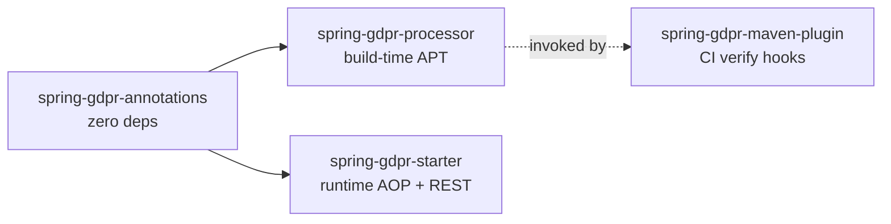
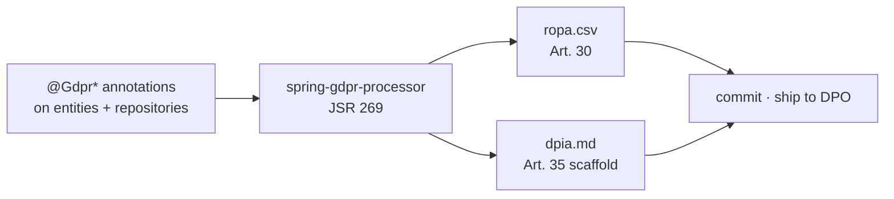

# spring-gdpr

> **GDPR evidence, generated from your annotations.** Annotate your domain types once, get a deterministic Article 30 ROPA + Article 35 DPIA at every build, a runtime audit log, a right-to-erasure flow and retention enforcement. Apache 2.0, no SaaS, no data egress.

[](https://github.com/iambilotta/spring-gdpr/actions/workflows/ci.yml)
[](https://github.com/iambilotta/spring-gdpr/actions/workflows/codeql.yml)
[](https://jitpack.io/#iambilotta/spring-gdpr)
[](https://github.com/iambilotta/spring-gdpr/releases)
[](LICENSE)
[](https://adoptium.net/)
[](https://spring.io/projects/spring-boot)

```
For:     Lead engineer (Java/Kotlin) in an EU-regulated company with a Spring Boot stack
Does:    Generates ROPA + DPIA at build, audits personal-data access at runtime,
         orchestrates Article 17 erasure, enforces Article 5(1)(e) retention
Effort:  ~30 min to wire on a fresh Spring Boot service, ~3h to production-ready
         (Spring Security on /gdpr/**, Flyway migration applied, ErasureHandler per
         personal-data table)
Cost:    Apache 2.0, no SaaS, no data egress, evidence stays on your infra
Status:  v1.1.0 stable, distributed via JitPack
```

[**Quick start**](#quick-start) ·
[**Architecture**](#architecture) ·
[**ADRs**](docs/adr/) ·
[**Performance**](#performance) ·
[**Runnable example**](examples/quickstart-postgres) ·
[**Reality check**](#reality-check) ·
[**Changelog**](CHANGELOG.md)

---

## The pitch in 30 seconds

You are the lead engineer of a Spring Boot service that touches personal data. Your DPO walks in and asks for the ROPA, the DPIA, and the audit log of who read what about whom in the last quarter.

Without this library you spend a week extracting the answer from Confluence, a logging channel, and tribal memory. The answer drifts from the live code the moment you ship the next feature.

With this library you annotate the `Customer` class once, the answers are regenerated at every build, and the runtime audit log is queryable by subject id.

```java
@GdprDataSubjects(categories = {"customer"})                        // → ROPA "data subjects" column
@GdprLegalBasis(value = LawfulBasis.CONTRACT, article = "6(1)(b)",  // → ROPA "legal basis" column
                specialBasis = Art9Condition.EXPLICIT_CONSENT)
@GdprRetention(period = "P5Y", strategy = Strategy.ANONYMIZE)        // → ROPA + retention sweep
@GdprErasable(strategy = GdprErasable.Strategy.DELETE,               // → /gdpr/erasure orchestration
              subjectIdField = "id")
public class Customer {
  @GdprPersonalData                            private String email;            // → audited at every read
  @GdprPersonalData(specialCategory = true)    private String healthCondition;  // → flagged Art. 9 in DPIA
}
```

That single class becomes the source of truth for the dossier (Article 30 ROPA, Article 35 DPIA), the runtime evidence (Article 15 access log) and the data-subject flows (Article 17 erasure, Article 5(1)(e) retention).

Every `mvn compile` regenerates:

```csv
# target/generated-sources/annotations/spring/gdpr/ropa.csv
entity,data_subjects,legal_basis,retention_period,strategy,special_category
com.example.Customer,customer,6(1)(b) + 9(2)(a),P5Y,ANONYMIZE,true
```

```markdown
# target/generated-sources/annotations/spring/gdpr/dpia.md  (excerpt)

## 1. Records of processing activities (Art. 30)

| Entity              | Data subjects | Legal basis        | Retention | Strategy   | Special category |
|---------------------|---------------|--------------------|-----------|------------|------------------|
| com.example.Customer | customer      | 6(1)(b) + 9(2)(a)  | P5Y       | ANONYMIZE  | yes              |

## 2. Personal-data access points
| Type                                 | Member          |
|--------------------------------------|-----------------|
| com.example.CustomerRepository       | findBySubjectId |

## 3. Necessity and proportionality assessment
(Fill in.)
...
```

The same annotations drive the runtime: every read of `email` or `healthCondition` is audited, `DELETE /gdpr/erasure/{subjectId}` orchestrates removal, and the `@Scheduled` retention sweep enforces the P5Y window.

## Architecture

`spring-gdpr` ships as **two separately consumable halves**: a build-time annotation processor and a runtime starter. Adopters can take just one (see [ADR-0003](docs/adr/0003-build-time-and-runtime-as-two-products.md)).

### Module dependency graph



### Build-time pipeline (mvn compile)



### Runtime pipeline (Spring Boot)

```mermaid
flowchart LR
    advisor["@GdprPersonalData advisor<br/>Spring AOP"]
    async[AsyncAuditSinkDecorator<br/>bounded queue, drop-newest]
    sink[AuditSink<br/>SLF4J · JDBC · custom]
    rest1[GET /gdpr/audit/access<br/>Art. 15]
    rest2[DELETE /gdpr/erasure/&#123;subjectId&#125;<br/>Art. 17]
    sched["@Scheduled retention sweep<br/>Art. 5(1)(e)"]

    advisor --> async --> sink
    sink --> rest1
    sink -. erase .- rest2
    sink -. enforce .- sched
```



The runtime advisor reads the same `@Gdpr*` annotations the build-time processor reads. Source of truth never splits ([ADR-0001](docs/adr/0001-annotations-as-source-of-truth.md)).

## Quick start

Distributed via [JitPack](https://jitpack.io/#iambilotta/spring-gdpr). **Maven Central is deliberately not planned**: this repo is a reference / portfolio asset of the maintainer, not a commercially supported product, and Maven Central imposes a permanent release-pipeline tax (immutable releases, GPG key custody, Sonatype workflows) that is only worth paying once an adopter explicitly requires it. See the sister ADR-0005 on [spring-aiact](https://github.com/iambilotta/spring-aiact/blob/main/docs/adr/0005-jitpack-distribution-v1.md) for the full rationale; the gdpr side mirrors it.

**1. Add the JitPack repository:**

```xml
<repositories>
  <repository><id>jitpack.io</id><url>https://jitpack.io</url></repository>
</repositories>
```

**2. Add the runtime starter:**

```xml
<dependency>
  <groupId>com.github.iambilotta.spring-gdpr</groupId>
  <artifactId>spring-gdpr-starter</artifactId>
  <version>v1.1.0</version>
</dependency>
```

**3. Wire the build-time generator on the compiler:**

```xml
<plugin>
  <groupId>org.apache.maven.plugins</groupId>
  <artifactId>maven-compiler-plugin</artifactId>
  <configuration>
    <annotationProcessorPaths>
      <path>
        <groupId>com.github.iambilotta.spring-gdpr</groupId>
        <artifactId>spring-gdpr-processor</artifactId>
        <version>v1.1.0</version>
      </path>
    </annotationProcessorPaths>
  </configuration>
</plugin>
```

**4. Apply the audit-table migration via Flyway:**

```
classpath:db/migration/V1__gdpr_audit_access.sql
```

(or the bundled Liquibase changelog at `db/changelog/spring-gdpr-changelog.xml`)

**5. Annotate one domain entity** (see the example above), `mvn compile`, open the two generated files under `target/generated-sources/annotations/spring/gdpr/`.

End-to-end runnable example with PostgreSQL via Docker Compose + Spring Security: [`examples/quickstart-postgres`](examples/quickstart-postgres). Cross-library demo composed with `spring-aiact`: [`spring-gdpr-aiact-demo`](https://github.com/iambilotta/spring-gdpr-aiact-demo).

## How right-to-erasure actually works

Upfront, because this is the first question every evaluator asks.

`DELETE /gdpr/erasure/{subjectId}` does **not** magically purge every table that references the subject. It calls the `ErasureHandler` beans you register, in dependency order, and writes one audit row per handler. The library does three things:

1. discovers handlers and orders them so that child rows are erased before the parent (you declare the order via `@GdprErasable.order` and `dependsOn`),
2. invokes each handler on the subject id,
3. audits each handler call (subject id, target type, strategy, outcome).

You write the `ErasureHandler.erase(subjectId)` for each table that holds personal data. The library handles ordering, audit and HTTP shape, and returns `207 Multi-Status` if a handler partially failed. See [ADR-0004](docs/adr/0004-erasure-handler-orchestration.md) for the why.

For the routine case (single table, hard delete) the handler is one method:

```java
@Component
public class CustomerErasureHandler implements ErasureHandler {
    private final CustomerRepository repo;
    public CustomerErasureHandler(CustomerRepository repo) { this.repo = repo; }
    @Override public Class<?> entityType() { return Customer.class; }
    @Override public GdprErasable.Strategy strategy() { return GdprErasable.Strategy.DELETE; }
    @Override public int erase(String subjectId) { return repo.deleteBySubjectId(subjectId); }
    @Override public int order() { return 10; }
}
```

The example in [`examples/quickstart-postgres`](examples/quickstart-postgres) wires three handlers across `Customer`, `Order`, `MarketingPreference`.

## Annotations

| Annotation | Target | What it does | Where it surfaces |
|---|---|---|---|
| `@GdprPersonalData` | type, method, field, parameter | Marks data as in-scope; AOP advisor logs every access. `specialCategory = true` flags Article 9 / 10 data | DPIA "Personal-data access points" + audit log |
| `@GdprDataSubjects` | type | Lists data-subject categories | ROPA "data subjects" column |
| `@GdprLegalBasis` | type, method | Lawful basis (Article 6 / 9 / 10). Build warns if missing on a ROPA record | ROPA "legal basis" column |
| `@GdprRetention` | type | Retention period + strategy (delete / anonymize / pseudonymize) | ROPA + retention sweep |
| `@GdprErasable` | type | Right-to-erasure participation, FK-safe ordering | DPIA + erasure flow |

Article 9 special categories (health, biometric) and Article 10 (criminal convictions) compose: `specialBasis` / `criminalBasis` on `@GdprLegalBasis` produce a composite reference like `6(1)(b) + 9(2)(h)` in the audit row.

## Configuration

```yaml
spring:
  gdpr:
    enabled: true
    web:
      base-path: /gdpr                 # wire Spring Security around <base-path>/**
    audit:
      jdbc-enabled: true               # required for /gdpr/audit/access
      table: gdpr_audit_access
      auto-create-schema: false        # production: apply the bundled migration via Flyway
      async:
        enabled: true                  # async ON by default, see ADR-0002
        thread-count: 1
        queue-capacity: 1024
    retention:
      enabled: true
      cron: "0 0 3 * * *"              # see ADR-0005
    erasure:
      rest-enabled: true
```

IDE autocomplete is wired via the bundled `additional-spring-configuration-metadata.json`.

## Wiring with Spring Security

The starter does **not** add authentication. The `/gdpr/**` endpoints are sensitive (erasure deletes data, access export reveals subjects), so wire your security rules:

```java
@Configuration
@EnableWebSecurity
public class GdprSecurityConfig {
  @Bean
  SecurityFilterChain gdprFilterChain(HttpSecurity http) throws Exception {
    http
        .securityMatcher("/gdpr/**")
        .authorizeHttpRequests(auth -> auth.anyRequest().hasRole("DPO"))
        .csrf(csrf -> csrf.ignoringRequestMatchers("/gdpr/erasure/**"))
        .httpBasic(Customizer.withDefaults());
    return http.build();
  }
  @Bean
  ActorResolver gdprActorResolver() {
    return () -> {
      Authentication auth = SecurityContextHolder.getContext().getAuthentication();
      return auth != null ? auth.getName() : "system";
    };
  }
}
```

Audit rows now record the actual authenticated principal instead of the default `"system"`.

## Performance

Numbers are not "trust me, it is fast"; they are JMH-measured. Re-run the harness on your hardware:

```bash
./mvnw -B -DskipTests -pl spring-gdpr-benchmark -am package
java -jar spring-gdpr-benchmark/target/benchmarks.jar
```

Reference run on Corretto 25, Linux x86_64, `-wi 2 -i 3 -f 1`:

| Mode | Per-call cost (request thread) |
|---|---|
| sync, no-op sink | **~1 ns** |
| async, no-op sink (default v1.x) | **~260 ns** |
| async, 1 ms-blocking downstream | **~2 µs** |

The async-blocking number is the load-bearing claim of [ADR-0002](docs/adr/0002-async-audit-sink-default.md): the request thread does not wait on the sink. A 1 ms downstream (typical JDBC INSERT) does not appear on the request side because the work is offloaded to the bounded queue.

Above ~1024 events/sec/pod (the default queue capacity) the queue saturates and the `dropped` Micrometer counter increments. Bump `spring.gdpr.audit.async.queue-capacity` or shard the sink. See [Reality check](#reality-check).

Raw JSON: [`spring-gdpr-benchmark/results/2026-05-02-jdk25-corretto.json`](spring-gdpr-benchmark/results/2026-05-02-jdk25-corretto.json).

## Observability

When Micrometer is on the classpath, three gauges register automatically:

| Meter | Meaning | Alert when |
|---|---|---|
| `spring.gdpr.audit.submitted` | events delivered to the async worker | informational |
| `spring.gdpr.audit.dropped` | events dropped due to queue saturation | `rate(...[5m]) > 0` |
| `spring.gdpr.audit.failed` | events that reached the sink and the sink threw | `rate(...[5m]) > 0` |

A positive `dropped` rate means audit gaps under load; bump `queue-capacity` or shard your sink.

## Architecture decisions

The full decision rationale lives under [`docs/adr/`](docs/adr/). Highlights:

- [ADR-0001](docs/adr/0001-annotations-as-source-of-truth.md): annotations as source of truth, vs YAML / SaaS / XML.
- [ADR-0002](docs/adr/0002-async-audit-sink-default.md): async sink with bounded queue + drop-newest by default.
- [ADR-0003](docs/adr/0003-build-time-and-runtime-as-two-products.md): build-time generator and runtime starter as two adoptable halves.
- [ADR-0004](docs/adr/0004-erasure-handler-orchestration.md): user-provided `ErasureHandler` beans, library does ordering + audit + HTTP shape.
- [ADR-0005](docs/adr/0005-retention-via-spring-scheduled.md): retention sweep via `@Scheduled`, configurable cron.
- [ADR-0006](docs/adr/0006-typed-class-on-spi.md): typed `Class<?>` on SPI `entityType()`, supersedes the v0.1.x String shape.
- [ADR-0007](docs/adr/0007-subjectidfield-is-documentation-only.md): `@GdprErasable.subjectIdField` is doc surfaced in DPIA, not a runtime lookup driver.
- [ADR-0008](docs/adr/0008-consent-and-portability-deferred.md) [proposed]: Article 7 consent and Article 20 portability deferred to a future minor.

## Reality check

What this library does NOT do, in one place. Read this before adopting in production.

| Area | What can hurt you | Mitigation |
|---|---|---|
| Throughput | Default async queue 1024, 1 worker. Sustained ~10k+/sec/pod saturates and drops | Bump `queue-capacity` and `thread-count`, or ship audit to SLF4J + log aggregator |
| Engine portability | Bundled migration uses `BOOLEAN` and `CREATE INDEX IF NOT EXISTS`. Oracle and DB2 reject both | Adapt the SQL for those engines |
| Default-open REST | `/gdpr/erasure` and `/gdpr/audit/access` ship without auth | You MUST wire Spring Security; see above |
| Async-by-default | Audit gaps under saturation are real, not hypothetical | Observable via `dropped` counter + WARN logs. Set `async.enabled=false` for zero-loss audit, accept request-thread blocking |
| `subjectIdField` is documentation | The annotated field is shown in DPIA; it does NOT drive the lookup | Default `SubjectIdResolver` looks for a parameter literally named `subjectId` (case-insensitive). Override the bean for custom resolution. See [ADR-0007](docs/adr/0007-subjectidfield-is-documentation-only.md) |
| Multi-pod retention | `@Scheduled` fires on every pod; three pods triple-call `applyDue` | Configure leader election (ShedLock recipe in a future minor) |

What the library is NOT:

- not a DPO substitute (output is evidence-as-code, not legal advice),
- not a certifier (only a DPA / Garante can certify; we ship the dossier inputs),
- not a Logback wrapper (without DPIA + ROPA generators it would be an audit logger, which is not what GDPR asks for),
- not a complete GDPR coverage: Article 7 consent, Article 20 portability, Article 33-34 breach notification are out of scope today (see [ADR-0008](docs/adr/0008-consent-and-portability-deferred.md)).

## Roadmap

| Version | Scope |
|---|---|
| v1.1 (current, May 2026) | API freeze: 5 annotations, AOP advisor, async sink, REST, retention, DPIA + ROPA generators. JitPack distribution |
| Future minor | Article 7 consent, Article 20 portability ([ADR-0008](docs/adr/0008-consent-and-portability-deferred.md)) |
| Future minor | ShedLock recipe for multi-pod retention |
| Future minor | Cross-border transfer (Art. 44+), SCC scaffold |

**On distribution:** Maven Central is **not** on the roadmap and is unlikely to be added unless a real adopter explicitly requires it. This repo is a reference / portfolio asset of the maintainer, not a commercial product; the cost of maintaining a Maven Central release pipeline (GPG key custody, immutable releases, Sonatype workflow) is permanent and only worth paying when there is concrete adopter demand. JitPack covers the consumer use case at zero ongoing maintenance cost.

## Module map

| Module | Purpose |
|---|---|
| `spring-gdpr-annotations` | The five annotations. Zero runtime deps |
| `spring-gdpr-starter` | Auto-configured AOP advisor, async sink, retention scheduler, REST endpoints |
| `spring-gdpr-processor` | APT processor: writes `dpia.md` + `ropa.csv` |
| `spring-gdpr-maven-plugin` | CLI goals (`gdpr:dpia`, `gdpr:ropa`, `gdpr:verify`) for CI |
| `spring-gdpr-starter-test` | Internal demo + integration suite |
| `spring-gdpr-benchmark` | JMH harness (not distributed) |

## About

Built by [Francesco Bilotta](https://iambilotta.com), Lead Software Engineer. The library is the externalised version of patterns I have wired into Spring Boot products in regulated environments (real estate, fintech-adjacent), where the same problem (live audit + auto-generated DPIA from code) kept getting re-solved in private repos. `spring-gdpr` is the Apache 2.0 distillation: same patterns, made public so they stop being rebuilt from scratch on every project.

Sister repo [spring-aiact](https://github.com/iambilotta/spring-aiact) covers the EU AI Act on the same evidence-as-code foundation. Combined demo: [spring-gdpr-aiact-demo](https://github.com/iambilotta/spring-gdpr-aiact-demo).

Contact: francesco@iambilotta.com. Security reports: see [SECURITY.md](SECURITY.md). Support routing: see [SUPPORT.md](SUPPORT.md).

## License

Apache License 2.0. See [LICENSE](LICENSE).
