# spring-gdpr

> **GDPR compliance, generated from your annotations.** Annotate your domain types once. Get a deterministic Article 30 ROPA + Article 35 DPIA at every build, plus a runtime audit log, a right-to-erasure flow and retention enforcement. Apache 2.0, no SaaS sign-up, evidence stays on your infra.

[](https://github.com/iambilotta/spring-gdpr/actions/workflows/ci.yml)
[](https://github.com/iambilotta/spring-gdpr/actions/workflows/codeql.yml)
[](https://jitpack.io/#iambilotta/spring-gdpr)
[](https://github.com/iambilotta/spring-gdpr/releases)
[](LICENSE)
[](https://adoptium.net/)
[](https://spring.io/projects/spring-boot)

[**Quick start**](#quick-start) ·
[**Runnable example**](examples/quickstart-postgres) ·
[**Architecture**](#architecture) ·
[**Reality check**](#reality-check) ·
[**Changelog**](CHANGELOG.md)

---

## Without spring-gdpr vs with it

Every GDPR audit starts the same way: a DPO opens a `DPIA-2024-Q3.docx` shared by a colleague who left two quarters ago, and finds it describes an architecture that is no longer in production.

**Without this library**, the typical path is:

- a SaaS like OneTrust or Privitar configured by hand and quietly drifting from the codebase, **or**
- a Confluence space + a custom Logback channel, owned by whoever currently has the hot potato. Either way, the ROPA, the DPIA and the access log all point at slightly different versions of reality.

**With this library**, all of those reduce to one source of truth: the annotations on your entity. Refactor it, the artifacts move with it. Remove a `@GdprPersonalData` field, the next build's ROPA reflects the change.

```java
@GdprDataSubjects(categories = {"customer"})
@GdprLegalBasis(value = LawfulBasis.CONTRACT, article = "6(1)(b)",
                specialBasis = Art9Condition.EXPLICIT_CONSENT)
@GdprRetention(period = "P5Y", strategy = Strategy.ANONYMIZE)
@GdprErasable(strategy = GdprErasable.Strategy.DELETE, subjectIdField = "id")
public class Customer {
  @GdprPersonalData                            private String email;
  @GdprPersonalData(specialCategory = true)    private String healthCondition;
}
```

Every `mvn compile` produces:

```csv
# target/generated-sources/annotations/spring/gdpr/ropa.csv
entity,data_subjects,legal_basis,retention_period,strategy,special_category
com.example.Customer,customer,6(1)(b) + 9(2)(a),P5Y,ANONYMIZE,true
```

```markdown
# target/generated-sources/annotations/spring/gdpr/dpia.md
## 1. Records of processing activities (Art. 30)

| Entity              | Data subjects | Legal basis        | Retention | Strategy   | Special category |
|---------------------|---------------|--------------------|-----------|------------|------------------|
| com.example.Customer | customer      | 6(1)(b) + 9(2)(a)  | P5Y       | ANONYMIZE  | yes              |

## 2. Personal-data access points
| Type                                 | Member          |
|--------------------------------------|-----------------|
| com.example.CustomerRepository       | findBySubjectId |

## 3. Necessity and proportionality assessment
(Fill in.)
...
```

The same annotations drive the runtime audit log, the `DELETE /gdpr/erasure/{subjectId}` flow and the `@Scheduled` retention sweep.

## Two products, one source of truth

`spring-gdpr` ships two complementary halves. You can adopt one without the other.

| Half | When it runs | Triggered by | Produces | Ship to |
|---|---|---|---|---|
| **Build-time generator** | `mvn compile` (annotation processor) | every annotated type | `ropa.csv`, `dpia.md` under `target/generated-sources/annotations/spring/gdpr/` | the DPO, your evidence repo, your CI artifacts |
| **Runtime starter** | live in your JVM | every method touching a `@GdprPersonalData` member | audit rows on SLF4J / JDBC, `GET /gdpr/audit/access` (Art. 15), `DELETE /gdpr/erasure/{subjectId}` (Art. 17), `@Scheduled` retention sweep (Art. 5(1)(e)) | your DPO via dossier, your data subjects via REST |

If you only need DPIA / ROPA today, take just `spring-gdpr-processor` plus `spring-gdpr-annotations`. The runtime starter is additive.

## Architecture

```mermaid
flowchart LR
    subgraph build["Build time"]
        direction TB
        A1["@GdprDataSubjects<br/>@GdprLegalBasis<br/>@GdprRetention<br/>@GdprErasable"] --> APT[APT processor]
        APT --> ROPA["ropa.csv<br/>(Art. 30)"]
        APT --> DPIA["dpia.md<br/>(Art. 35 scaffold)"]
        ROPA --> COMMIT[commit them,<br/>ship to your DPO]
        DPIA --> COMMIT
    end

    subgraph runtime["Runtime"]
        direction TB
        PD["@GdprPersonalData<br/>on method or field"] --> ADV[PersonalDataAccessAdvisor<br/>Spring AOP]
        ADV --> ASYNC[AsyncAuditSinkDecorator<br/>bounded queue,<br/>drop-newest]
        ASYNC --> SINK[AuditSink<br/>SLF4J · JDBC · custom]
        SINK -. queryable .- REST1[GET /gdpr/audit/access<br/>Art. 15]
        SINK -. erase .- REST2[DELETE /gdpr/erasure/&#123;subjectId&#125;<br/>Art. 17]
        SINK -. retention .- SCHED["@Scheduled sweep<br/>Art. 5(1)(e)"]
    end

    A1 -. same source<br/>of truth .- PD
```



<details>
<summary>ASCII fallback</summary>

```
        ┌─ build time ────────────────────────────┐    ┌─ runtime ─────────────────────────────────┐
        │   @GdprDataSubjects                      │    │   @GdprPersonalData                        │
        │   @GdprLegalBasis      ──┐               │    │            │                               │
        │   @GdprRetention         │               │    │            ▼                               │
        │   @GdprErasable          ├─►  APT        │    │   PersonalDataAccessAdvisor (Spring AOP)   │
        │                          │   processor   │    │            │                               │
        │                          ▼               │    │            ▼                               │
        │   target/generated-sources/              │    │   AsyncAuditSinkDecorator (bounded queue)  │
        │     ├── ropa.csv   (Art. 30)             │    │            │                               │
        │     └── dpia.md    (Art. 35 scaffold)    │    │            ▼                               │
        │                                          │    │   AuditSink (SLF4J | JDBC | custom)        │
        │                                          │    │       ▲ queryable for Art. 15 export       │
        │                                          │    │   GET  /gdpr/audit/access                  │
        │                                          │    │   DELETE /gdpr/erasure/{subjectId}         │
        │                                          │    │   @Scheduled retention sweep (Art. 5(1)(e))│
        └──────────────────────────────────────────┘    └────────────────────────────────────────────┘
```
</details>

## Should I use this?

| Use it if | Skip it if |
|---|---|
| You run Spring Boot 3.5+ in a regulated context (EU enterprise, healthcare-adjacent, public sector) | Your stack is not Spring Boot |
| Your DPO is part-time and wants a dossier they can read in an hour | You need a notarized PDF with a wet signature today |
| You already lived through a GDPR audit and watched the SaaS dashboard drift from the codebase | You are pre-revenue B2C with three engineers; a Markdown file is enough |
| You want evidence-as-code, reproducible from a git SHA | You want a SaaS dashboard with a no-code admin |
| You can wire Spring Security around the GDPR REST endpoints | You expect the library to ship authentication |

## Quick start

> Distributed via [JitPack](https://jitpack.io/#iambilotta/spring-gdpr). JitPack builds the tag on first request and caches the artifacts. No Sonatype account or credentials needed on your side.

**1. Add the JitPack repository:**

```xml
<repositories>
  <repository>
    <id>jitpack.io</id>
    <url>https://jitpack.io</url>
  </repository>
</repositories>
```

**2. Add the runtime starter:**

```xml
<dependency>
  <groupId>com.github.iambilotta.spring-gdpr</groupId>
  <artifactId>spring-gdpr-starter</artifactId>
  <version>v0.1.1</version>
</dependency>
```

**3. Wire the build-time generator:**

```xml
<plugin>
  <groupId>org.apache.maven.plugins</groupId>
  <artifactId>maven-compiler-plugin</artifactId>
  <configuration>
    <annotationProcessorPaths>
      <path>
        <groupId>com.github.iambilotta.spring-gdpr</groupId>
        <artifactId>spring-gdpr-processor</artifactId>
        <version>v0.1.1</version>
      </path>
    </annotationProcessorPaths>
  </configuration>
</plugin>
```

**4. Apply the audit-table migration via Flyway:**

```
classpath:db/migration/V1__gdpr_audit_access.sql
```

(or the bundled Liquibase changelog at `db/changelog/spring-gdpr-changelog.xml`)

**5. Annotate one domain entity** (see [the example above](#without-spring-gdpr-vs-with-it)) and run `mvn compile`. Open the two generated files under `target/generated-sources/annotations/spring/gdpr/`.

**Optional, fail CI when generators stop running:**

```xml
<plugin>
  <groupId>com.github.iambilotta.spring-gdpr</groupId>
  <artifactId>spring-gdpr-maven-plugin</artifactId>
  <version>v0.1.1</version>
  <executions><execution><goals><goal>verify</goal></goals></execution></executions>
</plugin>
```

End-to-end runnable example with PostgreSQL via Docker Compose + Spring Security: see [`examples/quickstart-postgres`](examples/quickstart-postgres).

## How right-to-erasure actually works

This is the question that matters in production, so the answer is upfront and not hidden in a footnote.

`DELETE /gdpr/erasure/{subjectId}` does **not** magically purge every table that references the subject. It calls the `ErasureHandler` beans you register, in dependency order, and writes one audit row per handler. The library does three things:

1. it discovers handlers and orders them so that child rows are erased before the parent (you declare the order on `@GdprErasable.dependsOn`),
2. it audits each handler call (subject id, table, strategy: DELETE / ANONYMIZE / PSEUDONYMIZE, outcome),
3. it returns 207 Multi-Status if a handler partially failed, with the per-handler outcome list.

You write the `ErasureHandler.erase(subjectId)` for each table that holds personal data. The library handles ordering, audit and HTTP shape. This is intentional: only your code knows whether `Customer` cascades to `Order`, whether `Order` should be anonymized rather than deleted, and whether external systems (CRM, mailer) need to be notified. A library that pretended to know would erase the wrong things.

For the routine case (single table, hard delete) the handler is one method. The example in [`examples/quickstart-postgres`](examples/quickstart-postgres) wires three handlers across `Customer`, `Order`, `MarketingPreference`.

## Annotations

| Annotation | Target | What it does |
|---|---|---|
| `@GdprPersonalData` | type, method, field, parameter | Marks data as in-scope. AOP advisor logs every access. Set `specialCategory = true` for Article 9 / 10 data |
| `@GdprDataSubjects` | type | Lists data-subject categories (Article 30) |
| `@GdprLegalBasis` | type, method | Declares lawful basis (Article 6 / 9 / 10). Build warns if missing on a ROPA record |
| `@GdprRetention` | type | Retention period + strategy (delete / anonymize / pseudonymize), Article 5(1)(e) |
| `@GdprErasable` | type | Right-to-erasure participation (Article 17), with FK-safe ordering |

For Article 9 special categories (health, biometric, religion, ...) and Article 10 (criminal convictions), set `specialBasis` / `criminalBasis` on `@GdprLegalBasis`. The audit log records a composite reference like `6(1)(b) + 9(2)(h)`.

## Configuration

```yaml
spring:
  gdpr:
    enabled: true
    web:
      base-path: /gdpr                 # wire Spring Security around <base-path>/**
    audit:
      jdbc-enabled: true               # required for /gdpr/audit/access
      table: gdpr_audit_access
      auto-create-schema: false        # production: apply the bundled migration via Flyway
      async:
        enabled: true                  # async ON by default
        thread-count: 1
        queue-capacity: 1024
    retention:
      enabled: true
      cron: "0 0 3 * * *"
    erasure:
      rest-enabled: true
```

IDE autocomplete is wired: typing `spring.gdpr.` in IntelliJ / VSCode / Eclipse pulls property descriptions and defaults from the bundled `additional-spring-configuration-metadata.json`.

## Observability

When Micrometer is on the classpath, three gauges register automatically:

| Meter | Meaning | Alert when |
|---|---|---|
| `spring.gdpr.audit.submitted` | events delivered to the async worker | informational |
| `spring.gdpr.audit.dropped` | events dropped due to queue saturation | `rate(...[5m]) > 0` |
| `spring.gdpr.audit.failed` | events that reached the sink and the sink threw | `rate(...[5m]) > 0` |

A positive `dropped` rate means audit gaps under load; bump `queue-capacity` or shard your sink. A positive `failed` rate means downstream sink errors; check WARN/ERROR lines under the `gdpr.audit` logger.

## Wiring with Spring Security

The starter does **not** add authentication. The `/gdpr/**` endpoints are sensitive (erasure deletes data, access export reveals subjects), so wire your security rules around them:

```java
@Configuration
@EnableWebSecurity
public class GdprSecurityConfig {

  @Bean
  SecurityFilterChain gdprFilterChain(HttpSecurity http) throws Exception {
    http
        .securityMatcher("/gdpr/**")
        .authorizeHttpRequests(auth -> auth.anyRequest().hasRole("DPO"))
        .csrf(csrf -> csrf.ignoringRequestMatchers("/gdpr/erasure/**"))
        .httpBasic(Customizer.withDefaults());
    return http.build();
  }

  @Bean
  ActorResolver gdprActorResolver() {
    return () -> {
      Authentication auth = SecurityContextHolder.getContext().getAuthentication();
      return auth != null ? auth.getName() : "system";
    };
  }
}
```

Audit rows now record the actual authenticated principal instead of the default `"system"`.

## Reality check

A library that pretends to do everything is a library you cannot trust. Here is what `spring-gdpr` does NOT do, and where it breaks under stress.

**What this library is not:**

- Not a DPO substitute. Output is evidence-as-code, not legal advice.
- Not a certifier. Only a notified body can certify; we ship the dossier inputs.
- Not an inventor of regulation. Every article reference points to text that exists in the GDPR.
- Not a Logback wrapper. Without DPIA + ROPA generators it would be an audit logger, which is not what GDPR asks for.

**Operational gotchas before you deploy:**

| Area | What can hurt you | Mitigation |
|---|---|---|
| Throughput | Default async queue is 1024 entries with 1 worker. Sustained ~10k+ accesses/sec/pod will saturate and start dropping | Bump `queue-capacity` and `thread-count`, or ship audit to SLF4J + log aggregator |
| Engine portability | Bundled migration uses `BOOLEAN` and `CREATE INDEX IF NOT EXISTS`. Oracle and DB2 reject both | Adapt the SQL for those engines; auto-create dev shortcut warns on the index but the table will fail without an adapted DDL |
| Default-open REST | `/gdpr/erasure` and `/gdpr/audit/access` ship without auth | You MUST wire Spring Security; see [Wiring](#wiring-with-spring-security) |
| Async-by-default | Audit gaps under saturation are real, not hypothetical | Observable via `dropped` counter + WARN logs. Set `async.enabled=false` for zero-loss audit, accept request-thread blocking |
| JDBC throughput | No batching. Each event is a single `INSERT` | Custom `AuditSink` bean that batches, for >1k events/sec on JDBC |
| `subjectIdField` is documentation | The annotated field is shown in the DPIA; it does NOT drive the lookup. The actual lookup is whatever your `ErasureHandler.erase(subjectId)` does | Default `SubjectIdResolver` looks for a parameter literally named `subjectId` (case-insensitive). For `findById(String id)`, override the bean to read MDC, security context, or a tenant header |

**Performance.** The advisor on `@GdprPersonalData` adds one method-call indirection plus one task submitted to a bounded `LinkedBlockingQueue`. The request thread does not wait on the audit append. Worst case, under saturation, the queue overflows and events are dropped (and counted), not the request. Synchronous mode is available when zero-loss audit matters more than tail latency. Measure with your own workload before committing.

## Common questions

**Do I have to use JDBC for the audit log?** No. Default sink is SLF4J. Set `spring.gdpr.audit.jdbc-enabled=true` only if you need the Article 15 right-of-access endpoint to query historical events. Many teams ship audit through SLF4J to ELK / Loki / Datadog and query there.

**Can I plug my own audit sink?** Yes. Declare a `@Bean AuditSink`. The starter's auto-config sees the user-supplied bean and skips its own. The async decorator wraps your sink too if you reuse the autoconfig path.

**What happens to the audit log when the DB is down?** With async ON (default): events queue up to `queue-capacity`, beyond that the `dropped` counter increments and a WARN logs. The request thread is never blocked. With async OFF: the sink failure is logged at ERROR by the advisor and the business method continues regardless.

**Can I run `spring-gdpr` without Spring Boot?** Not at v0.1. The autoconfig is Spring Boot 3.5+. Plain Spring Framework support is feasible but unscoped.

**Is the DPIA scaffold submission-ready?** No. Sections 1 and 2 (records of processing + access points) are populated mechanically. Sections 3-6 (necessity, risks, mitigation, DPO consultation) are intentionally empty: those are human judgment calls. The processor fills the parts that are mechanical and leaves the parts that need a human empty, instead of producing a confidently wrong template.

## Roadmap

| Version | Scope |
|---|---|
| v0.1 | annotations, AOP advisor, async sink, REST, retention, DPIA + ROPA generator |
| v0.2 | consent management (Art. 7), data portability export (Art. 20) |
| v0.3 | cross-border transfer (Art. 44+), SCC scaffold |
| v1.0 | API freeze, performance hardening, multi-tenant audit table, Maven Central in addition to JitPack |

## About

Built by [Francesco Bilotta](https://iambilotta.com), Lead Software Engineer. The library is the externalised version of patterns I have wired into Spring Boot products in regulated environments (real estate, fintech-adjacent), where the same problem (live audit + auto-generated DPIA from code) kept getting re-solved in private repos. `spring-gdpr` is the Apache 2.0 distillation: same patterns, made public so they stop being rebuilt from scratch on every project.

Sister repo [spring-aiact](https://github.com/iambilotta/spring-aiact) covers the EU AI Act (Article 11 Technical File, Article 12 audit log, Article 47 Declaration of Conformity) on the same evidence-as-code foundation. The two compose: a service that processes personal data and falls under Annex III typically needs both.

Contact: francesco@iambilotta.com. Security reports: see [SECURITY.md](SECURITY.md).

## Module map

| Module | Purpose |
|---|---|
| `spring-gdpr-annotations` | The five annotations. Zero runtime deps. Safe to import from any module |
| `spring-gdpr-starter` | Auto-configured AOP advisor, async sink, retention scheduler, REST endpoints, audit sinks |
| `spring-gdpr-processor` | APT processor: writes `dpia.md` + `ropa.csv` to `target/generated-sources/annotations/spring/gdpr/` |
| `spring-gdpr-maven-plugin` | CLI goals (`gdpr:dpia`, `gdpr:ropa`, `gdpr:verify`) for CI |
| `spring-gdpr-starter-test` | Internal demo + integration suite (round-trip annotation -> audit -> erasure -> artifacts) |

## License

Apache License 2.0. See [LICENSE](LICENSE).
