# spring-gdpr

[](https://github.com/iambilotta/spring-gdpr/actions/workflows/ci.yml)
[](https://github.com/iambilotta/spring-gdpr/actions/workflows/codeql.yml)
[](https://central.sonatype.com/artifact/com.iambilotta.gdpr/spring-gdpr-starter)
[](LICENSE)
[](https://adoptium.net/)
[](https://spring.io/projects/spring-boot)

**GDPR compliance, generated from your annotations.** Annotate domain types once. Get a queryable audit log, a right-to-erasure flow, retention enforcement, and a deterministic Article 35 DPIA + Article 30 ROPA at every build. Apache 2.0, no SaaS sign-up, evidence stays on your infra.

## You write this

```java
@GdprDataSubjects(categories = {"customer"})
@GdprLegalBasis(value = LawfulBasis.CONTRACT, article = "6(1)(b)",
                specialBasis = Art9Condition.EXPLICIT_CONSENT)
@GdprRetention(period = "P5Y", strategy = Strategy.ANONYMIZE)
@GdprErasable(strategy = GdprErasable.Strategy.DELETE, subjectIdField = "id")
public class Customer {
  @GdprPersonalData                            private String email;
  @GdprPersonalData(specialCategory = true)    private String healthCondition;
}
```

## You get this, at every `mvn compile`

```csv
# target/generated-sources/annotations/spring/gdpr/ropa.csv
entity,data_subjects,legal_basis,retention_period,strategy,special_category
com.example.Customer,customer,6(1)(b) + 9(2)(a),P5Y,ANONYMIZE,true
```

```markdown
# target/generated-sources/annotations/spring/gdpr/dpia.md
## 1. Records of processing activities (Art. 30)

| Entity              | Data subjects | Legal basis        | Retention | Strategy   | Special category |
|---------------------|---------------|--------------------|-----------|------------|------------------|
| com.example.Customer | customer      | 6(1)(b) + 9(2)(a)  | P5Y       | ANONYMIZE  | yes              |

## 2. Personal-data access points
| Type                                | Member          |
|-------------------------------------|-----------------|
| com.example.CustomerRepository       | findBySubjectId |

## 3. Necessity and proportionality assessment
(Fill in.)
...
```

The same annotations drive the runtime audit log, the `DELETE /gdpr/erasure/{subjectId}` flow, and the `@Scheduled` retention sweep. Build-time and runtime never disagree, because there is one source of truth: the code.

[Jump to setup ↓](#setup-in-five-minutes) · [Should I use this? ↓](#should-i-use-this) · [Reality check ↓](#reality-check)

---

## Quick links

[Should I use this?](#should-i-use-this) ·
[Common questions](#common-questions) ·
[Setup in five minutes](#setup-in-five-minutes) ·
[Architecture](#architecture) ·
[Annotations](#annotations) ·
[Configuration](#configuration) ·
[Observability](#observability) ·
[Wiring with Spring Security](#wiring-with-spring-security) ·
[Reality check](#reality-check) ·
[Quickstart example](examples/quickstart-postgres/README.md)

## Should I use this?

| Use it if | Skip it if |
|---|---|
| You run Spring Boot 3.5+ in regulated context (EU enterprise, healthcare-adjacent, public sector) | Your stack is not Spring Boot |
| Your DPO is part-time and wants a dossier they can read in an hour | You need a notarized PDF with a wet signature today |
| You already lived through a GDPR audit and watched the SaaS dashboard drift from the codebase | You are pre-revenue B2C with three engineers; a Markdown file is enough |
| You want evidence-as-code, reproducible from a git SHA | You want a SaaS dashboard with a no-code admin |
| You can wire Spring Security around the GDPR REST endpoints | You expect the library to ship authentication |

## Common questions

**Do I have to use JDBC for the audit log?**
No. Default sink is SLF4J. Set `spring.gdpr.audit.jdbc-enabled=true` only if you need the Article 15 right-of-access endpoint to query historical events. Many teams ship audit through SLF4J to ELK / Loki / Datadog and query there.

**Can I plug my own audit sink?**
Yes. Declare a `@Bean AuditSink`. The starter's auto-config sees the user-supplied bean and skips its own. The async decorator wraps your sink too if you reuse the autoconfig path.

**What happens to the audit log when the DB is down?**
With async ON (default): events queue up to `queue-capacity`, beyond that the `dropped` counter increments and a WARN logs. The request thread is never blocked. With async OFF: the sink failure is logged at ERROR by the advisor and the business method continues regardless.

**Can I run `spring-gdpr` without Spring Boot?**
Not at v0.1. The autoconfig is Spring Boot 3.5+. Plain Spring Framework support is feasible but unscoped.

**Is the DPIA scaffold submission-ready?**
No. Sections 1 and 2 (records of processing + access points) are populated mechanically. Sections 3-6 (necessity, risks, mitigation, DPO consultation) are intentionally empty. Those are human judgment calls. The processor fills the parts that are mechanical and leaves the parts that need a human empty, instead of producing a confidently wrong template.

## Setup in five minutes

> v0.1 is not yet on Maven Central (namespace claim pending). Until publication, build from source: `git clone https://github.com/iambilotta/spring-gdpr && mvn -DskipTests install`. After publication, the snippets below resolve directly.

**1. Add the runtime starter:**

```xml
<dependency>
  <groupId>com.iambilotta.gdpr</groupId>
  <artifactId>spring-gdpr-starter</artifactId>
  <version>0.1.0</version>
</dependency>
```

**2. Wire the build-time generator on the compiler plugin:**

```xml
<plugin>
  <groupId>org.apache.maven.plugins</groupId>
  <artifactId>maven-compiler-plugin</artifactId>
  <configuration>
    <annotationProcessorPaths>
      <path>
        <groupId>com.iambilotta.gdpr</groupId>
        <artifactId>spring-gdpr-processor</artifactId>
        <version>0.1.0</version>
      </path>
    </annotationProcessorPaths>
  </configuration>
</plugin>
```

**3. Apply the audit-table migration via Flyway:**

```
classpath:db/migration/V1__gdpr_audit_access.sql
```

(or the bundled Liquibase changelog at `db/changelog/spring-gdpr-changelog.xml`)

**4. Annotate one domain entity** (see [the example at the top of this README](#you-write-this))

**5. Run `mvn compile`** and open the two generated files under `target/generated-sources/annotations/spring/gdpr/`.

**Optional, fail CI when generators stop running:**

```xml
<plugin>
  <groupId>com.iambilotta.gdpr</groupId>
  <artifactId>spring-gdpr-maven-plugin</artifactId>
  <version>0.1.0</version>
  <executions><execution><goals><goal>verify</goal></goals></execution></executions>
</plugin>
```

For an end-to-end runnable example with PostgreSQL via Docker Compose + Spring Security: see [`examples/quickstart-postgres/`](examples/quickstart-postgres/README.md).

## Architecture

```mermaid
flowchart LR
    subgraph build["Build time"]
        direction TB
        A1["@GdprDataSubjects<br/>@GdprLegalBasis<br/>@GdprRetention<br/>@GdprErasable"] --> APT[APT processor]
        APT --> ROPA["ropa.csv<br/>(Art. 30)"]
        APT --> DPIA["dpia.md<br/>(Art. 35 scaffold)"]
        ROPA --> COMMIT[commit them,<br/>ship to your DPO]
        DPIA --> COMMIT
    end

    subgraph runtime["Runtime"]
        direction TB
        PD["@GdprPersonalData<br/>on method or field"] --> ADV[PersonalDataAccessAdvisor<br/>Spring AOP]
        ADV --> ASYNC[AsyncAuditSinkDecorator<br/>bounded queue,<br/>drop-newest]
        ASYNC --> SINK[AuditSink<br/>SLF4J · JDBC · custom]
        SINK -. queryable .- REST1[GET /gdpr/audit/access<br/>Art. 15]
        SINK -. erase .- REST2[DELETE /gdpr/erasure/&#123;subjectId&#125;<br/>Art. 17]
        SINK -. retention .- SCHED["@Scheduled sweep<br/>Art. 5(1)(e)"]
    end

    A1 -. same source<br/>of truth .- PD
```



<details>
<summary>ASCII fallback for environments without Mermaid</summary>

```
        ┌─ build time ────────────────────────────┐    ┌─ runtime ─────────────────────────────────┐
        │   @GdprDataSubjects                      │    │   @GdprPersonalData                        │
        │   @GdprLegalBasis      ──┐               │    │            │                               │
        │   @GdprRetention         │               │    │            ▼                               │
        │   @GdprErasable          ├─►  APT        │    │   PersonalDataAccessAdvisor (Spring AOP)   │
        │                          │   processor   │    │            │                               │
        │                          ▼               │    │            ▼                               │
        │   target/generated-sources/              │    │   AsyncAuditSinkDecorator (bounded queue)  │
        │     ├── ropa.csv   (Art. 30)             │    │            │                               │
        │     └── dpia.md    (Art. 35 scaffold)    │    │            ▼                               │
        │                                          │    │   AuditSink (SLF4J | JDBC | custom)        │
        │                                          │    │       ▲ queryable for Art. 15 export       │
        │                                          │    │   GET  /gdpr/audit/access                  │
        │                                          │    │   DELETE /gdpr/erasure/{subjectId}         │
        │                                          │    │   @Scheduled retention sweep (Art. 5(1)(e))│
        └──────────────────────────────────────────┘    └────────────────────────────────────────────┘
```
</details>

## Annotations

| Annotation | Target | What it does |
|---|---|---|
| `@GdprPersonalData` | type, method, field, parameter | Marks data as in-scope. AOP advisor logs every access. Set `specialCategory = true` for Article 9 / 10 data. |
| `@GdprDataSubjects` | type | Lists data-subject categories (Article 30). |
| `@GdprLegalBasis` | type, method | Declares lawful basis (Article 6 / 9 / 10). Build warns if missing on a ROPA record. |
| `@GdprRetention` | type | Retention period + strategy (delete / anonymize / pseudonymize), Article 5(1)(e). |
| `@GdprErasable` | type | Right-to-erasure participation (Article 17), with FK-safe ordering. |

For Article 9 special categories (health, biometric, religion, ...) and Article 10 (criminal convictions), set `specialBasis` / `criminalBasis` on `@GdprLegalBasis`. The audit log records a composite reference like `6(1)(b) + 9(2)(h)`.

## Configuration

```yaml
spring:
  gdpr:
    enabled: true
    web:
      base-path: /gdpr                 # wire Spring Security around <base-path>/**
    audit:
      jdbc-enabled: true               # required for /gdpr/audit/access
      table: gdpr_audit_access
      auto-create-schema: false        # production: apply the bundled migration via Flyway
      async:
        enabled: true                  # async ON by default
        thread-count: 1
        queue-capacity: 1024
    retention:
      enabled: true
      cron: "0 0 3 * * *"
    erasure:
      rest-enabled: true
```

IDE autocomplete is wired: typing `spring.gdpr.` in IntelliJ / VSCode / Eclipse pulls property descriptions and defaults from the bundled `additional-spring-configuration-metadata.json`.

## Observability

When Micrometer is on the classpath (Spring Boot Actuator pulls it in), three gauges register automatically:

| Meter | Meaning | Alert when |
|---|---|---|
| `spring.gdpr.audit.submitted` | events delivered to the async worker | informational |
| `spring.gdpr.audit.dropped` | events dropped due to queue saturation | `rate(...[5m]) > 0` |
| `spring.gdpr.audit.failed` | events that reached the sink and the sink threw | `rate(...[5m]) > 0` |

A positive `dropped` rate means audit gaps under load; bump `queue-capacity` or shard your sink. A positive `failed` rate means downstream sink errors; check WARN/ERROR lines under the `gdpr.audit` logger.

## Wiring with Spring Security

The starter does **not** add authentication. The `/gdpr/**` endpoints are sensitive (erasure deletes data, access export reveals subjects), so wire your security rules around them:

```java
@Configuration
@EnableWebSecurity
public class GdprSecurityConfig {

  @Bean
  SecurityFilterChain gdprFilterChain(HttpSecurity http) throws Exception {
    http
        .securityMatcher("/gdpr/**")
        .authorizeHttpRequests(auth -> auth.anyRequest().hasRole("DPO"))
        .csrf(csrf -> csrf.ignoringRequestMatchers("/gdpr/erasure/**"))
        .httpBasic(Customizer.withDefaults());
    return http.build();
  }

  @Bean
  ActorResolver gdprActorResolver() {
    return () -> {
      Authentication auth = SecurityContextHolder.getContext().getAuthentication();
      return auth != null ? auth.getName() : "system";
    };
  }
}
```

Audit rows now record the actual authenticated principal instead of the default `"system"`.

## Reality check

A library that pretends to do everything is a library you cannot trust. Here is what `spring-gdpr` does NOT do, and where it breaks under stress.

**What this library is not:**

- Not a DPO substitute. Output is evidence-as-code, not legal advice.
- Not a certifier. Only a notified body can certify; we ship the dossier inputs.
- Not an inventor of regulation. Every article reference points to text that exists in the GDPR.
- Not a Logback wrapper. Without DPIA + ROPA generators it would be an audit logger, which is not what GDPR asks for.

**Operational gotchas before you deploy:**

| Area | What can hurt you | Mitigation |
|---|---|---|
| Throughput | Default async queue is 1024 entries with 1 worker. Sustained ~10k+ accesses/sec/pod will saturate and start dropping. | Bump `queue-capacity` and `thread-count`, or ship audit to SLF4J + log aggregator. |
| Engine portability | Bundled migration uses `BOOLEAN` and `CREATE INDEX IF NOT EXISTS`. Oracle and DB2 reject both. | Adapt the SQL for those engines; auto-create dev shortcut warns on the index but the table will fail without an adapted DDL. |
| Default-open REST | `/gdpr/erasure` and `/gdpr/audit/access` ship without auth. | You MUST wire Spring Security; see [Wiring](#wiring-with-spring-security). |
| Async-by-default | Audit gaps under saturation are real, not hypothetical. | Observable via `dropped` counter + WARN logs. Set `async.enabled=false` for zero-loss audit, accept request-thread blocking. |
| JDBC throughput | No batching. Each event is a single `INSERT`. | Custom `AuditSink` bean that batches, for >1k events/sec on JDBC. |
| `subjectIdField` is documentation | The annotated field is shown in the DPIA; it does NOT drive the lookup. The actual lookup is whatever your `ErasureHandler.erase(subjectId)` does. | Default `SubjectIdResolver` looks for a parameter literally named `subjectId` (case-insensitive). For `findById(String id)`, override the bean to read MDC, security context, or a tenant header. |

## Roadmap

| Version | Scope | Effort |
|---|---|---|
| v0.1 | annotations, AOP advisor, async sink, REST, retention, DPIA + ROPA generator | shipping |
| v0.2 | consent management (Art. 7), data portability export (Art. 20) | ~30-40h |
| v0.3 | cross-border transfer (Art. 44+), SCC scaffold | ~15-20h |
| v1.0 | API freeze, performance hardening, multi-tenant audit table | TBD |

## Community

- **Issues**: bugs, feature requests, regulatory clarification questions.
- **Discussions** (after public push): design questions, alternative approaches, "is this for me".
- **Security**: see [SECURITY.md](SECURITY.md), private disclosure to `francesco@iambilotta.com`.
- **Contributing**: see [CONTRIBUTING.md](CONTRIBUTING.md). DCO sign-off required.
- **Used by**: open a PR adding your org or product when you ship `spring-gdpr` to production.

## About

Built by [Francesco Bilotta](https://iambilotta.com), Senior Software Engineer.

I rescue legacy. The repo exists because every GDPR audit I have walked into started the same way: a DPO opening a folder shared from a colleague who left two quarters ago, with a `DPIA-2024-Q3.docx` that referenced an architecture no longer in production. The information was always already in the codebase. The tooling was missing.

Sister repo [spring-aiact](https://github.com/iambilotta/spring-aiact) covers the EU AI Act (Article 11 Technical File, Article 12 audit log, Article 47 Declaration of Conformity) on the same evidence-as-code foundation.

## Project files

- [LICENSE](LICENSE) (Apache 2.0)
- [CHANGELOG.md](CHANGELOG.md)
- [CONTRIBUTING.md](CONTRIBUTING.md)
- [CODE_OF_CONDUCT.md](CODE_OF_CONDUCT.md) (Contributor Covenant 2.1)
- [SECURITY.md](SECURITY.md) (90-day disclosure window)

## Module map

| Module | Purpose |
|---|---|
| `spring-gdpr-annotations` | The five annotations. Zero runtime deps. Safe to import from any module. |
| `spring-gdpr-starter` | Auto-configured AOP advisor, async sink, retention scheduler, REST endpoints, audit sinks. |
| `spring-gdpr-processor` | APT processor: writes `dpia.md` + `ropa.csv` to `target/generated-sources/annotations/spring/gdpr/`. |
| `spring-gdpr-maven-plugin` | CLI goals (`gdpr:dpia`, `gdpr:ropa`, `gdpr:verify`) for CI. |
| `spring-gdpr-starter-test` | Internal demo + integration suite (round-trip annotation -> audit -> erasure -> artifacts). |

## License

Apache License 2.0. See [LICENSE](LICENSE).
