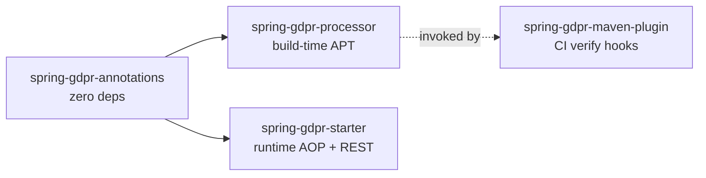
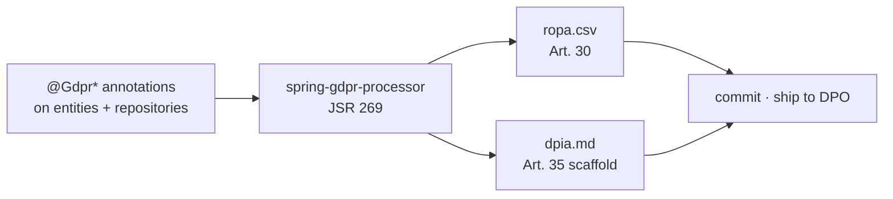

# spring-gdpr

> **GDPR evidence, generated from your annotations.** Annotate your domain types once, get a deterministic Article 30 ROPA + Article 35 DPIA at every build, a runtime audit log, a right-to-erasure flow and retention enforcement. Apache 2.0, no SaaS, no data egress.

[](https://github.com/iambilotta/spring-gdpr/actions/workflows/ci.yml)
[](https://github.com/iambilotta/spring-gdpr/actions/workflows/codeql.yml)
[](https://jitpack.io/#iambilotta/spring-gdpr)
[](https://github.com/iambilotta/spring-gdpr/releases)
[](LICENSE)
[](https://adoptium.net/)
[](https://spring.io/projects/spring-boot)

```
For:     Lead engineer (Java/Kotlin) in an EU-regulated company with a Spring Boot stack
Does:    Generates ROPA + DPIA at build, audits personal-data access at runtime,
         orchestrates Article 17 erasure, enforces Article 5(1)(e) retention
Effort:  ~30 min to wire on a fresh Spring Boot service, ~3h to production-ready
         (Spring Security on /gdpr/**, Flyway migration applied, ErasureHandler per
         personal-data table)
Cost:    Apache 2.0, no SaaS, no data egress, evidence stays on your infra
Status:  v2.x active line (Spring Boot 4+), v1.x LTS line (Spring Boot 3.5+) frozen at v1.1.0. JitPack distribution.
```

[**Quick start**](#quick-start) ·
[**Architecture**](#architecture) ·
[**ADRs**](docs/adr/) ·
[**Performance**](#performance) ·
[**Runnable example**](examples/quickstart-postgres) ·
[**Reality check**](#reality-check) ·
[**Changelog**](CHANGELOG.md)

---

## The pitch in 30 seconds

You are the lead engineer of a Spring Boot service that touches personal data. Your DPO walks in and asks for the ROPA, the DPIA, and the audit log of who read what about whom in the last quarter.

Without this library you spend a week extracting the answer from Confluence, a logging channel, and tribal memory. The answer drifts from the live code the moment you ship the next feature.

With this library you annotate the `Customer` class once, the answers are regenerated at every build, and the runtime audit log is queryable by subject id.

```java
@GdprDataSubjects(categories = {"customer"})                        // → ROPA "data subjects" column
@GdprLegalBasis(value = LawfulBasis.CONTRACT, article = "6(1)(b)",  // → ROPA "legal basis" column
                specialBasis = Art9Condition.EXPLICIT_CONSENT)
@GdprRetention(period = "P5Y", strategy = Strategy.ANONYMIZE)        // → ROPA + retention sweep
@GdprErasable(strategy = GdprErasable.Strategy.DELETE,               // → /gdpr/erasure orchestration
              subjectIdField = "id")
public class Customer {
  @GdprPersonalData                            private String email;            // → audited at every read
  @GdprPersonalData(specialCategory = true)    private String healthCondition;  // → flagged Art. 9 in DPIA
}
```

That single class becomes the source of truth for the dossier (Article 30 ROPA, Article 35 DPIA), the runtime evidence (Article 15 access log) and the data-subject flows (Article 17 erasure, Article 5(1)(e) retention).

Every `mvn compile` regenerates:

```csv
# target/generated-sources/annotations/spring/gdpr/ropa.csv
entity,data_subjects,legal_basis,retention_period,strategy,special_category
com.example.Customer,customer,6(1)(b) + 9(2)(a),P5Y,ANONYMIZE,true
```

```markdown
# target/generated-sources/annotations/spring/gdpr/dpia.md  (excerpt)

## 1. Records of processing activities (Art. 30)

| Entity              | Data subjects | Legal basis        | Retention | Strategy   | Special category |
|---------------------|---------------|--------------------|-----------|------------|------------------|
| com.example.Customer | customer      | 6(1)(b) + 9(2)(a)  | P5Y       | ANONYMIZE  | yes              |

## 2. Personal-data access points
| Type                                 | Member          |
|--------------------------------------|-----------------|
| com.example.CustomerRepository       | findBySubjectId |

## 3. Necessity and proportionality assessment
(Fill in.)
...
```

The same annotations drive the runtime: every read of `email` or `healthCondition` is audited, `DELETE /gdpr/erasure/{subjectId}` orchestrates removal, and the `@Scheduled` retention sweep enforces the P5Y window.

## Architecture

`spring-gdpr` ships as **two separately consumable halves**: a build-time annotation processor and a runtime starter. Adopters can take just one (see [ADR-0003](docs/adr/0003-build-time-and-runtime-as-two-products.md)).

### Module dependency graph



### Build-time pipeline (mvn compile)



### Runtime pipeline (Spring Boot)

```mermaid
flowchart LR
    advisor["@GdprPersonalData advisor<br/>Spring AOP"]
    async[AsyncAuditSinkDecorator<br/>bounded queue, drop-newest]
    sink[AuditSink<br/>SLF4J · JDBC · custom]
    rest1[GET /gdpr/audit/access<br/>Art. 15]
    rest2[DELETE /gdpr/erasure/&#123;subjectId&#125;<br/>Art. 17]
    sched["@Scheduled retention sweep<br/>Art. 5(1)(e)"]

    advisor --> async --> sink
    sink --> rest1
    sink -. erase .- rest2
    sink -. enforce .- sched
```



The runtime advisor reads the same `@Gdpr*` annotations the build-time processor reads. Source of truth never splits ([ADR-0001](docs/adr/0001-annotations-as-source-of-truth.md)).

## Quick start

Distributed via [JitPack](https://jitpack.io/#iambilotta/spring-gdpr). **Maven Central is deliberately not planned**: this repo is a reference / portfolio asset of the maintainer, not a commercially supported product. See the sister ADR-0005 on [spring-aiact](https://github.com/iambilotta/spring-aiact/blob/main/docs/adr/0005-jitpack-distribution-v1.md) for the full rationale.

> **Dual release line.** Pin the version that matches your Spring Boot.
>
> | Your stack | Pin |
> |---|---|
> | Spring Boot 3.5+ | `v1.1.0` (LTS line, frozen, no active maintenance) |
> | Spring Boot 4.0+ | `v2.0.0` (active line) |

**1. Add the JitPack repository:**

```xml
<repositories>
  <repository><id>jitpack.io</id><url>https://jitpack.io</url></repository>
</repositories>
```

**2. Add the runtime starter:**

```xml
<dependency>
  <groupId>com.github.iambilotta.spring-gdpr</groupId>
  <artifactId>spring-gdpr-starter</artifactId>
  <version>v2.0.0</version>
</dependency>
```

**3. Wire the build-time generator on the compiler:**

```xml
<plugin>
  <groupId>org.apache.maven.plugins</groupId>
  <artifactId>maven-compiler-plugin</artifactId>
  <configuration>
    <annotationProcessorPaths>
      <path>
        <groupId>com.github.iambilotta.spring-gdpr</groupId>
        <artifactId>spring-gdpr-processor</artifactId>
        <version>v2.0.0</version>
      </path>
    </annotationProcessorPaths>
  </configuration>
</plugin>
```

**4. Add the schema to your own migration sequence.**

The published jar **deliberately does not ship runnable migrations**: a library must not own your
Flyway version sequence (shipping `db/migration/V1..V3` would squat versions 1-3 on the default
`classpath:db/migration` location and break the build of any adopter that already has a `V1`). Copy
the reference DDL into your own migration sequence, with your own version numbers:

- audit log: [`spring-gdpr-starter/src/main/resources/db/migration/V1__gdpr_audit_access.sql`](spring-gdpr-starter/src/main/resources/db/migration/V1__gdpr_audit_access.sql)
- forgettable-payload store (primary erasure path): [`V3__gdpr_forgettable_payload.sql`](spring-gdpr-starter/src/main/resources/db/migration/V3__gdpr_forgettable_payload.sql)
- subject-key store (only if you use crypto-shredding): [`V2__gdpr_subject_key.sql`](spring-gdpr-starter/src/main/resources/db/migration/V2__gdpr_subject_key.sql)

The DDL files stay in the repo as the canonical reference (and on this module's own test classpath);
they are just not handed to you on a path that collides with yours. The
[`examples/quickstart-postgres`](examples/quickstart-postgres) does exactly this (its own `db/migration`).

**5. Annotate one domain entity** (see the example above), `mvn compile`, open the two generated files under `target/generated-sources/annotations/spring/gdpr/`.

> **A note on the groupId.** Consumers pulling from JitPack use `com.github.iambilotta.spring-gdpr` (JitPack derives the groupId from the GitHub coordinates). The artifacts' own Maven coordinates are `com.iambilotta.gdpr` (the `groupId` in each module's `pom.xml`); that is what you use when you build and install locally, as the bundled [`examples/quickstart-postgres`](examples/quickstart-postgres) does. Same jars, two coordinate namespaces depending on how you resolve them.

End-to-end runnable example with PostgreSQL via Docker Compose + Spring Security: [`examples/quickstart-postgres`](examples/quickstart-postgres). Cross-library demo composed with `spring-aiact`: [`spring-gdpr-aiact-demo`](https://github.com/iambilotta/spring-gdpr-aiact-demo).

## How right-to-erasure actually works

Upfront, because this is the first question every evaluator asks.

`DELETE /gdpr/erasure/{subjectId}` does **not** magically purge every table that references the subject. It calls the `ErasureHandler` beans you register, in dependency order, and writes one audit row per handler. The library does three things:

1. discovers handlers and orders them so that child rows are erased before the parent (you declare the order via `@GdprErasable.order` and `dependsOn`),
2. invokes each handler on the subject id,
3. audits each handler call (subject id, target type, strategy, outcome).

You write the `ErasureHandler.erase(subjectId)` for each table that holds personal data. The library handles ordering and audit and returns the per-handler aggregate as `200 OK`. The orchestration is fail-fast, not partial-status: if a handler throws, the call stops at that handler and the exception propagates (handlers already run are committed, later handlers do not run). There is no `207 Multi-Status`: wrap the handlers you need to be atomic in a single transactional handler, and declare FK-safe ordering via `@GdprErasable.order` so a wrong order surfaces as a database constraint violation at the first call. See [ADR-0004](docs/adr/0004-erasure-handler-orchestration.md) for the why and the [Reality check](#reality-check) for the failure contract.

For the routine case (single table, hard delete) the handler is one method:

```java
@Component
public class CustomerErasureHandler implements ErasureHandler {
    private final CustomerRepository repo;
    public CustomerErasureHandler(CustomerRepository repo) { this.repo = repo; }
    @Override public Class<?> entityType() { return Customer.class; }
    @Override public GdprErasable.Strategy strategy() { return GdprErasable.Strategy.DELETE; }
    @Override public int erase(String subjectId) { return repo.deleteBySubjectId(subjectId); }
    @Override public int order() { return 10; }
}
```

The example in [`examples/quickstart-postgres`](examples/quickstart-postgres) wires a `Customer` handler end to end (REST -> handler -> delete -> audited report).

### Ready-made JDBC adapters (skip the boilerplate)

The three SPIs (`ErasureHandler`, `RetentionTarget`, `SubjectDataProvider`) are the escape hatch for any store. For the common "one table, one subject-id column" case you do not hand-write the SQL: register the JDBC base class with a couple of constructor args.

```java
@Bean
ErasureHandler customerErasure(DataSource ds) {
    // DELETE FROM customers WHERE subject_id = ?   (subject id always bound, never interpolated)
    return new JdbcErasureHandler(ds, Customer.class, "customers", "subject_id", Strategy.DELETE);
}

@Bean
RetentionTarget customerRetention(DataSource ds) {
    // ANONYMIZE: NULL the listed personal-data columns on rows older than the cutoff
    return new JdbcRetentionTarget(ds, Customer.class, "customers", "created_at",
            Duration.ofDays(365 * 5), Strategy.ANONYMIZE, "full_name", "email");
}

@Bean
SubjectDataProvider customerExport(DataSource ds) {
    // SELECT * FROM customers WHERE id = ?  -> map each row to a @GdprPersonalData-annotated object
    return new JdbcSubjectDataProvider(ds, "customers", "id",
            (rs, n) -> new Customer(rs.getString("full_name"), rs.getString("email")));
}
```

Table and column names are validated as bare SQL identifiers at construction (they cannot be JDBC-bound), so a typo or a hostile value fails fast and never reaches the database; the subject id and the cutoff are always `?`-bound. When the case is anything richer (FK cascade in a transaction, pseudonymise with a deterministic token, a non-JDBC store), implement the raw SPI interface directly.

## Erasing personal data: forgettable payload (primary), crypto-shredding (exception)

For a **mutable** store the handler above just `DELETE`s the row. The hard case is an **append-only / event-sourced** store, where the golden rule is "never edit or delete an event": the event that carries the PII cannot be deleted. The library ships two mechanisms, and is opinionated about which to reach for.

### The primary pattern: forgettable payload (external PII store)

Keep the personal data **out of the immutable carrier**. A field marked `@GdprPersonalData(storage = FORGETTABLE_PAYLOAD)` is not stored inline on the domain object or event; its value lives in a dedicated **mutable external store** keyed by `(subjectId, fieldKey)`, and the carrier holds only a **reference** (`urn:gdpr:fp:<subjectId>:<fieldKey>`).

```java
// write: externalise the value, carry only the reference on the event/row
store.put("alice-1", "full_name", "Alice Liddell");
var ref = ForgettablePayloadReference.of("alice-1", "full_name");   // urn:gdpr:fp:alice-1:full_name

// read: resolve the reference back to its value (fail-closed if erased)
resolver.resolve(ref);            // Optional<String>, empty once erased
resolver.require(ref);            // throws PayloadNotAvailableException instead of faking a value

// erase (Art. 17): an ACTUAL DELETE of the subject's external rows + an audit fact
new ForgettablePayloadErasureHandler(store, auditSink, actorResolver, Customer.class).erase("alice-1");
```

Wire it like the other JDBC adapters (apply migration `db/migration/V3__gdpr_forgettable_payload.sql`):

```java
@Bean ForgettablePayloadStore piiStore(DataSource ds) { return new JdbcForgettablePayloadStore(ds); }
@Bean ForgettablePayloadResolver piiResolver(ForgettablePayloadStore s) { return new ForgettablePayloadResolver(s); }
@Bean ErasureHandler piiErasure(ForgettablePayloadStore s, AuditSink a, ActorResolver r) {
    return new ForgettablePayloadErasureHandler(s, a, r, Customer.class);
}
```

Erasure is a real `DELETE` of the value (or an anonymising overwrite to a placeholder). It is **anonymisation**: because the carrier never held the value, deleting the external row leaves nothing to re-associate. A dropped subject is tombstoned, so a later `put` for them is refused (no silent resurrection), exactly like the key store below.

### The exception: crypto-shredding (ADR-0009)

Encrypt the PII inside the event with a **per-subject key**; erasure is the **drop of that key**, after which the byte-immutable ciphertext is unreadable. Use this **only when an immutable event must legally carry the value inline** and externalising it is not acceptable (a signed/notarised event, an integrity requirement).

It is the secondary path on purpose. Encryption with a separately-held key is, in law, **pseudonymisation**, not anonymisation: GDPR Recital 26 and **EDPB Guidelines 01/2025** treat data re-associable via held information (the key) as still personal data, and the erasure claim hinges on **total, irreversible destruction of every key copy** (live store, every backup, every replica), which is operationally fragile and legally contested. See **[ADR-0010](docs/adr/0010-forgettable-payload-primary-pattern.md)** for the full legal nuance, and **[ADR-0009](docs/adr/0009-append-only-erasure-crypto-shredding.md)** for the crypto-shredding mechanism (`SubjectKeyStore`, `AesGcmCryptoShredder`, `CryptoShreddingErasureHandler`, migration `V2`).

### Both at once

When a subject's data is split across both paths, register both handlers (the erasure orchestration runs every handler) or wrap them in a `CompositeSubjectErasureHandler`, which erases across both as one unit and sums the affected counts so neither path is forgotten.

### Declarative: skip the wiring

You do not have to hand-wire the handler at all. Declare the strategy on the type and the starter wires the matching handler for you:

```java
@GdprErasable(strategy = Strategy.FORGETTABLE)              // -> ForgettablePayloadErasureHandler, auto-wired
record CustomerSnapshot(String subjectId, ForgettablePayloadReference fullName) {}

@GdprErasable(strategy = Strategy.CRYPTO_SHRED, order = 20) // -> CryptoShreddingErasureHandler, auto-wired
record SignedAgreementEvent(String subjectId, byte[] encryptedTerms) {}
```

The starter scans your application packages for `@GdprErasable` types whose strategy is `FORGETTABLE` or `CRYPTO_SHRED` and registers one handler per type, so `DELETE /gdpr/erasure/{subjectId}` routes them through the existing machinery with **zero** `@Configuration`. It also contributes the backing store beans (`ForgettablePayloadStore` + `ForgettablePayloadResolver`, or `SubjectKeyStore`): JDBC when a `DataSource` is present (apply migration `V3` / `V2`), in-memory otherwise (dev/test only, logged). Every contributed bean is `@ConditionalOnMissingBean`, so declaring your own (a KMS-backed `SubjectKeyStore`, a PII-vault `ForgettablePayloadStore`) overrides it. The declared `order()` flows to the handler for FK-safe sequencing, and the strategy is named in the generated DPIA. `DELETE` / `ANONYMIZE` / `PSEUDONYMIZE` are untouched: they stay your own `ErasureHandler` (the library cannot know how to delete an arbitrary store, [ADR-0004](docs/adr/0004-erasure-handler-orchestration.md)).

### React after erasure (event-sourced / CQRS rebuilds)

The forgettable-payload pattern leaves the read side with a reference that now resolves to nothing (the same way a crypto-shred drop makes inline ciphertext unreadable). Read models that resolved that reference (a display name on a projection, a cached value) must heal: rebuild the projection, invalidate the cache, re-render the now-opaque ref. After `ErasureService.eraseSubject` honours the request, the library gives you a deterministic signal so you do not poll. Two equivalent hooks, both fire once per successful erasure, after the handlers committed:

```java
// SPI: implement and register as a bean (no Spring context needed)
@Bean ErasureListener rebuildProjections(ProjectionRebuilder rebuilder) {
    return report -> rebuilder.rebuildFor(report.subjectId());   // report.affectedByType() = per-type counts
}

// or the Spring-native event
@EventListener
void onErased(SubjectErasedEvent event) {
    rebuilder.rebuildFor(event.subjectId());
}
```

The erasure has already committed by the time a listener runs, so a listener that throws never un-erases the subject: the other listeners still run and the failure is surfaced as an `ErasureListenerException` (logged, never swallowed) rather than silently lost. Make a listener idempotent, since a rebuild may be retried. With no listener and no `@EventListener` this is a no-op (backward compatible). Pairs with [ADR-0009](docs/adr/0009-append-only-erasure-crypto-shredding.md) / [ADR-0010](docs/adr/0010-forgettable-payload-primary-pattern.md).

## Annotations

| Annotation | Target | What it does | Where it surfaces |
|---|---|---|---|
| `@GdprPersonalData` | type, method, field, parameter | Marks data as in-scope; AOP advisor logs every access. `specialCategory = true` flags Article 9 / 10 data | DPIA "Personal-data access points" + audit log |
| `@GdprDataSubjects` | type | Lists data-subject categories | ROPA "data subjects" column |
| `@GdprLegalBasis` | type, method | Lawful basis (Article 6 / 9 / 10). Build warns if missing on a ROPA record | ROPA "legal basis" column |
| `@GdprRetention` | type | Retention period + strategy (delete / anonymize / pseudonymize) | ROPA + retention sweep |
| `@GdprErasable` | type | Right-to-erasure participation, FK-safe ordering. `strategy = FORGETTABLE` / `CRYPTO_SHRED` auto-wires the library's handler; `DELETE` / `ANONYMIZE` / `PSEUDONYMIZE` stay your own | DPIA + erasure flow |

Article 9 special categories (health, biometric) and Article 10 (criminal convictions) compose: `specialBasis` / `criminalBasis` on `@GdprLegalBasis` produce a composite reference like `6(1)(b) + 9(2)(h)` in the audit row.

### Data categories (`@GdprPersonalData.category`)

`@GdprPersonalData` carries a coarse `category` axis, orthogonal to `specialCategory`: `IDENTITY`, `CONTACT`, `FINANCIAL`, and the backward-compatible default `UNCATEGORISED`. It is deliberately small (a fine-grained taxonomy belongs in your data catalogue, not a compile-time annotation everyone maintains).

```java
@GdprPersonalData(description = "primary email", category = Category.CONTACT)
private String email;
```

The distinct categories touched by an entity surface in the `categories` column of `ropa.csv` (Art. 30 data-minimisation evidence), sorted and pipe-joined: e.g. `CONTACT|FINANCIAL|IDENTITY` for the demo `Customer`. The category also rides on every exported field in the Article 15 dossier (see below).

## Log redaction (`%piimsg`)

Accidentally logging a whole `@GdprPersonalData`-annotated object leaks personal data into your log files (Art. 5(1)(f)). The starter ships a Logback converter, `PiiMaskingConverter`, that masks every `@GdprPersonalData` argument while leaving non-personal arguments untouched. Register it as the `%piimsg` conversion word in `logback-spring.xml` and use it in place of `%msg`:

```xml
<conversionRule conversionWord="piimsg"
                class="com.iambilotta.gdpr.starter.logging.PiiMaskingConverter"/>
<pattern>%d %-5level %logger - %piimsg%n</pattern>
```

Now `log.info("loaded {}", customer)` renders as `Customer{id=alice-1, fullName=***, email=***, taxId=***}` instead of leaking the fields. It fails closed: a field it cannot read is masked, never printed. The example ships a ready [`logback-spring.xml`](examples/quickstart-postgres/src/main/resources/logback-spring.xml). (The `class` attribute is the Logback 1.5.16+ form; older docs used `converterClass`.)

## Article 15 access export

Beyond the audit log, the starter assembles the **right-of-access dossier** (Art. 15): every classified field a subject's records carry, across the stores you register. You implement one `SubjectDataProvider` per source (where the subject's data lives is the one thing only you know); the library reflects the `@GdprPersonalData` fields of whatever objects you return.

```java
@Bean
SubjectDataProvider customerDataProvider(CustomerRepository customers) {
    return subjectId -> customers.findById(subjectId).map(List::<Object>of).orElseGet(List::of);
}
```

Then `GET /gdpr/access/export?subjectId=...` returns the dossier:

```json
{
  "subjectId": "alice-1",
  "fields": [
    { "sourceType": "com.example.Customer", "field": "email",
      "value": "alice@example.com", "description": "primary email", "category": "CONTACT" }
  ]
}
```

Honesty contract (same as erasure): the export lists exactly what the registered providers return, never more. With no provider registered the `fields` array is simply empty. For the one-table case use the ready-made `JdbcSubjectDataProvider` (see [Ready-made JDBC adapters](#ready-made-jdbc-adapters-skip-the-boilerplate)).

## Configuration

```yaml
spring:
  gdpr:
    enabled: true
    web:
      base-path: /gdpr                 # wire Spring Security around <base-path>/**
    audit:
      jdbc-enabled: true               # required for /gdpr/audit/access
      table: gdpr_audit_access
      auto-create-schema: false        # production: apply the bundled migration via Flyway
      async:
        enabled: true                  # async ON by default, see ADR-0002
        thread-count: 1
        queue-capacity: 1024
    retention:
      enabled: true
      cron: "0 0 3 * * *"              # see ADR-0005
    erasure:
      rest-enabled: true
```

IDE autocomplete is wired via the bundled `additional-spring-configuration-metadata.json`.

## Wiring with Spring Security

The starter does **not** add authentication. The `/gdpr/**` endpoints are sensitive (erasure deletes data, the Art. 15 access export reveals a subject's dossier), so you **must** wire your own security rules. To make the foot-gun loud rather than silent, the starter logs a **startup WARN** whenever it mounts the surface:

```
spring-gdpr mounted its REST surface at /gdpr/** WITHOUT authentication. These endpoints
delete personal data ... Wire a SecurityFilterChain restricting /gdpr/** to a privileged role ...
```

The app still boots (fail-soft is good DX), but you cannot miss the open surface. Once you have secured the path, raise the `com.iambilotta.gdpr.starter.web.GdprSecurityWarning` logger to `ERROR` to silence it. Example wiring:

```java
@Configuration
@EnableWebSecurity
public class GdprSecurityConfig {
  @Bean
  SecurityFilterChain gdprFilterChain(HttpSecurity http) throws Exception {
    http
        .securityMatcher("/gdpr/**")
        .authorizeHttpRequests(auth -> auth.anyRequest().hasRole("DPO"))
        .csrf(csrf -> csrf.ignoringRequestMatchers("/gdpr/erasure/**"))
        .httpBasic(Customizer.withDefaults());
    return http.build();
  }
  @Bean
  ActorResolver gdprActorResolver() {
    return () -> {
      Authentication auth = SecurityContextHolder.getContext().getAuthentication();
      return auth != null ? auth.getName() : "system";
    };
  }
}
```

Audit rows now record the actual authenticated principal instead of the default `"system"`.

## Performance

Numbers are not "trust me, it is fast"; they are JMH-measured. Re-run the harness on your hardware:

```bash
./mvnw -B -DskipTests -pl spring-gdpr-benchmark -am package
java -jar spring-gdpr-benchmark/target/benchmarks.jar
```

Reference run on Corretto 25, Linux x86_64, `-wi 2 -i 3 -f 1`:

| Mode | Per-call cost (request thread) |
|---|---|
| sync, no-op sink | **~1 ns** |
| async, no-op sink (default v1.x) | **~260 ns** |
| async, 1 ms-blocking downstream | **~2 µs** |

The async-blocking number is the load-bearing claim of [ADR-0002](docs/adr/0002-async-audit-sink-default.md): the request thread does not wait on the sink. A 1 ms downstream (typical JDBC INSERT) does not appear on the request side because the work is offloaded to the bounded queue.

Above ~1024 events/sec/pod (the default queue capacity) the queue saturates and the `dropped` Micrometer counter increments. Bump `spring.gdpr.audit.async.queue-capacity` or shard the sink. See [Reality check](#reality-check).

Raw JSON: [`spring-gdpr-benchmark/results/2026-05-02-jdk25-corretto.json`](spring-gdpr-benchmark/results/2026-05-02-jdk25-corretto.json).

## Observability

When Micrometer is on the classpath, three gauges register automatically:

| Meter | Meaning | Alert when |
|---|---|---|
| `spring.gdpr.audit.submitted` | events delivered to the async worker | informational |
| `spring.gdpr.audit.dropped` | events dropped due to queue saturation | `rate(...[5m]) > 0` |
| `spring.gdpr.audit.failed` | events that reached the sink and the sink threw | `rate(...[5m]) > 0` |

A positive `dropped` rate means audit gaps under load; bump `queue-capacity` or shard your sink.

## Architecture decisions

The full decision rationale lives under [`docs/adr/`](docs/adr/). Highlights:

- [ADR-0001](docs/adr/0001-annotations-as-source-of-truth.md): annotations as source of truth, vs YAML / SaaS / XML.
- [ADR-0002](docs/adr/0002-async-audit-sink-default.md): async sink with bounded queue + drop-newest by default.
- [ADR-0003](docs/adr/0003-build-time-and-runtime-as-two-products.md): build-time generator and runtime starter as two adoptable halves.
- [ADR-0004](docs/adr/0004-erasure-handler-orchestration.md): user-provided `ErasureHandler` beans, library does ordering + audit + HTTP shape.
- [ADR-0005](docs/adr/0005-retention-via-spring-scheduled.md): retention sweep via `@Scheduled`, configurable cron.
- [ADR-0006](docs/adr/0006-typed-class-on-spi.md): typed `Class<?>` on SPI `entityType()`, supersedes the v0.1.x String shape.
- [ADR-0007](docs/adr/0007-subjectidfield-is-documentation-only.md): `@GdprErasable.subjectIdField` is doc surfaced in DPIA, not a runtime lookup driver.
- [ADR-0008](docs/adr/0008-consent-and-portability-deferred.md) [proposed]: Article 7 consent and Article 20 portability deferred to a future minor.
- [ADR-0010](docs/adr/0010-forgettable-payload-primary-pattern.md): forgettable payload (external PII store) is the **primary** personal-data erasure pattern; crypto-shredding ([ADR-0009](docs/adr/0009-append-only-erasure-crypto-shredding.md)) is the narrow exception (pseudonymisation vs anonymisation, Recital 26 / EDPB 01/2025).

## Living requirements (tracegate)

This repo dogfoods [**tracegate**](https://github.com/iambilotta/tracegate): every test is
treated as a requirement, and the catalog is generated from the test suite, never written by
hand. Each test-bearing module carries its own `_generated/` catalog (`requirements.md`,
`requirements-by-us.md`, `requirements.json`, plus as-built sections like `http-endpoints.md`,
`modules.md` and `config.md` where a framework is detected). The catalog covers
**107 requirements** across the four test-bearing modules (`spring-gdpr-starter`,
`spring-gdpr-processor`, `spring-gdpr-starter-test`, `examples/quickstart-postgres`).

The catalog is **generated, never hand-edited**. To change a requirement, change the test
(rename it, or add a `@spec.given` / `@spec.when` / `@spec.then` javadoc) and regenerate:

```bash
make tracegate-install   # one-off: install tracegate, pinned to the CI commit
make requirements        # regenerate every module's _generated/ catalog
make requirements-check  # drift-gate: exit 2 if the catalog drifted from the code
```

CI runs the gate (the `tracegate` job in
[`.github/workflows/ci.yml`](.github/workflows/ci.yml)), so the committed catalog can never
silently fall out of sync with the code. tracegate is pinned to a commit in both the Makefile
(`TRACEGATE_REF`) and the workflow. Which modules are catalogued, and their stable labels, is
pinned in [`tracegate.toml`](tracegate.toml) (stable labels keep the gate deterministic
regardless of the checkout directory name); add an `[[apps]]` block there when a new
test-bearing module appears.

## Reality check

What this library does NOT do, in one place. Read this before adopting in production.

| Area | What can hurt you | Mitigation |
|---|---|---|
| Throughput | Default async queue 1024, 1 worker. Sustained ~10k+/sec/pod saturates and drops | Bump `queue-capacity` and `thread-count`, or ship audit to SLF4J + log aggregator |
| Engine portability | The reference DDL uses `BOOLEAN` and `CREATE INDEX IF NOT EXISTS`. Oracle and DB2 reject both | Adapt the SQL for those engines when you copy it into your migrations |
| Default-open REST | `/gdpr/erasure`, `/gdpr/audit/access` and `/gdpr/access/export` ship without auth | You MUST wire Spring Security; see above. A startup WARN fires when the surface is mounted (see [Wiring with Spring Security](#wiring-with-spring-security)) |
| Erasure failure contract | A throwing `ErasureHandler` is **fail-fast**, not `207 Multi-Status`: the exception propagates as a raw `500`, handlers already run stay committed, later handlers do not run. A blank/unknown subject id is `400` | Make a multi-table erasure atomic inside one transactional handler. Declare FK-safe `order()`. There is no per-handler partial-status response |
| Async-by-default | Audit gaps under saturation are real, not hypothetical | Observable via `dropped` counter + WARN logs. Set `async.enabled=false` for zero-loss audit, accept request-thread blocking |
| `subjectIdField` is documentation | The annotated field is shown in DPIA; it does NOT drive the lookup | Default `SubjectIdResolver` looks for a parameter literally named `subjectId` (case-insensitive). Override the bean for custom resolution. See [ADR-0007](docs/adr/0007-subjectidfield-is-documentation-only.md) |
| Multi-pod retention | `@Scheduled` fires on every pod; three pods triple-call `applyDue` | Configure leader election (ShedLock recipe in a future minor) |

What the library is NOT:

- not a DPO substitute (output is evidence-as-code, not legal advice),
- not a certifier (only a DPA / Garante can certify; we ship the dossier inputs),
- not a Logback wrapper (without DPIA + ROPA generators it would be an audit logger, which is not what GDPR asks for),
- not a complete GDPR coverage: Article 7 consent, Article 20 portability, Article 33-34 breach notification are out of scope today (see [ADR-0008](docs/adr/0008-consent-and-portability-deferred.md)).

## Roadmap

| Version | Scope |
|---|---|
| v1.1 (current, May 2026) | API freeze: 5 annotations, AOP advisor, async sink, REST, retention, DPIA + ROPA generators. JitPack distribution |
| Future minor | Article 7 consent, Article 20 portability ([ADR-0008](docs/adr/0008-consent-and-portability-deferred.md)) |
| Future minor | ShedLock recipe for multi-pod retention |
| Future minor | Cross-border transfer (Art. 44+), SCC scaffold |

**On distribution:** Maven Central is **not** on the roadmap and is unlikely to be added unless a real adopter explicitly requires it. This repo is a reference / portfolio asset of the maintainer, not a commercial product; the cost of maintaining a Maven Central release pipeline (GPG key custody, immutable releases, Sonatype workflow) is permanent and only worth paying when there is concrete adopter demand. JitPack covers the consumer use case at zero ongoing maintenance cost.

## Module map

| Module | Purpose |
|---|---|
| `spring-gdpr-annotations` | The five annotations. Zero runtime deps |
| `spring-gdpr-starter` | Auto-configured AOP advisor, async sink, retention scheduler, REST endpoints |
| `spring-gdpr-processor` | APT processor: writes `dpia.md` + `ropa.csv` |
| `spring-gdpr-maven-plugin` | CLI goals (`gdpr:dpia`, `gdpr:ropa`, `gdpr:verify`) for CI |
| `spring-gdpr-starter-test` | Internal demo + integration suite |
| `spring-gdpr-benchmark` | JMH harness (not distributed) |

## About

Built by [Francesco Bilotta](https://iambilotta.com), Lead Software Engineer. The library is the externalised version of patterns I have wired into Spring Boot products in regulated environments (real estate, fintech-adjacent), where the same problem (live audit + auto-generated DPIA from code) kept getting re-solved in private repos. `spring-gdpr` is the Apache 2.0 distillation: same patterns, made public so they stop being rebuilt from scratch on every project.

Sister repo [spring-aiact](https://github.com/iambilotta/spring-aiact) covers the EU AI Act on the same evidence-as-code foundation. Combined demo: [spring-gdpr-aiact-demo](https://github.com/iambilotta/spring-gdpr-aiact-demo).

Contact: francesco@iambilotta.com. Security reports: see [SECURITY.md](SECURITY.md). Support routing: see [SUPPORT.md](SUPPORT.md).

## License

Apache License 2.0. See [LICENSE](LICENSE).
