# Modules — spring-gdpr-example-quickstart-postgres (as-is)

Auto-generated. Modulith convention: each top-level package under `it.housetreespa.gest` is a module. Cross-module dependencies are inferred from `import it.housetreespa.gest.<other>.*` statements. A cycle in the graph below is a Modulith violation: open the offending module file and re-route the dependency through a port or an event.

**Total modules**: 1

✓ No module cycles.

## Module summary

| Module | Files | Sub-packages | Exposed API (@NamedInterface) | Depends on |
|---|---|---|---|---|
| `(root)` | 7 | 1 | _(none)_ | _(none)_ |

## Dependency graph (PlantUML, copy-pasteable)

```plantuml
@startuml
skinparam componentStyle rectangle
component "(root)"
@enduml
```

## Detail

### `(root)`

- **Files**: 7
- **Sub-packages** (1):
  - `(root)`
- **Exposed API**: _(only the top-level package; no inner exports)_
- **Depends on**: _(no other gest module)_
