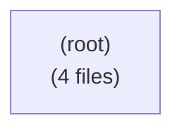

# Module map — spring-gdpr-starter-test (as-is)

Auto-generated from the same data as `modules.md`: each top-level package under `com.iambilotta.gdpr.demo` is a module, the arrows are the cross-module `import` dependencies. A cycle is a Modulith boundary violation (highlighted below). Rendered as Mermaid so it shows inline on GitHub and the intranet. Run `make code-docs`.

✓ No module cycles.

