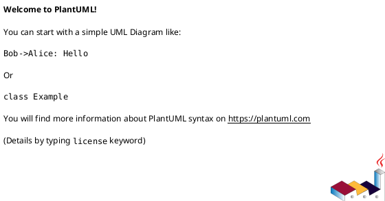

# JTE templates — spring-gdpr-starter-test (as-is)

Auto-generated from `apps/gest/src/main/jte/**/*.jte`. Each template lists its required `@param`s (with declared default if any) and the partials / sub-templates it pulls in via `@template....`. Missing a `@param` at render time = NPE; this tree is the contract between Java controllers and the view layer.

**Total templates**: 0

## Inclusion graph (PlantUML)

## Detail
