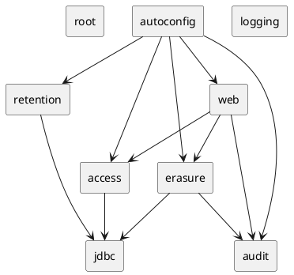

# Modules — spring-gdpr-starter (as-is)

Auto-generated. Modulith convention: each top-level package under `it.housetreespa.gest` is a module. Cross-module dependencies are inferred from `import it.housetreespa.gest.<other>.*` statements. A cycle in the graph below is a Modulith violation: open the offending module file and re-route the dependency through a port or an event.

**Total modules**: 9

✓ No module cycles.

## Module summary

| Module | Files | Sub-packages | Exposed API (@NamedInterface) | Depends on |
|---|---|---|---|---|
| `(root)` | 1 | 1 | _(none)_ | _(none)_ |
| `access` | 5 | 1 | _(none)_ | `jdbc` |
| `audit` | 9 | 1 | _(none)_ | _(none)_ |
| `autoconfig` | 1 | 1 | _(none)_ | `access`, `audit`, `erasure`, `retention`, `web` |
| `erasure` | 11 | 2 | _(none)_ | `audit`, `jdbc` |
| `jdbc` | 1 | 1 | _(none)_ | _(none)_ |
| `logging` | 2 | 1 | _(none)_ | _(none)_ |
| `retention` | 3 | 1 | _(none)_ | `jdbc` |
| `web` | 3 | 1 | _(none)_ | `access`, `audit`, `erasure` |

## Dependency graph (PlantUML, copy-pasteable)

## Detail

### `(root)`

- **Files**: 1
- **Sub-packages** (1):
  - `(root)`
- **Exposed API**: _(only the top-level package; no inner exports)_
- **Depends on**: _(no other gest module)_

### `access`

- **Files**: 5
- **Sub-packages** (1):
  - `access`
- **Exposed API**: _(only the top-level package; no inner exports)_
- **Depends on**:
  - `jdbc`

### `audit`

- **Files**: 9
- **Sub-packages** (1):
  - `audit`
- **Exposed API**: _(only the top-level package; no inner exports)_
- **Depends on**: _(no other gest module)_

### `autoconfig`

- **Files**: 1
- **Sub-packages** (1):
  - `autoconfig`
- **Exposed API**: _(only the top-level package; no inner exports)_
- **Depends on**:
  - `access`
  - `audit`
  - `erasure`
  - `retention`
  - `web`

### `erasure`

- **Files**: 11
- **Sub-packages** (2):
  - `erasure`
  - `erasure.crypto`
- **Exposed API**: _(only the top-level package; no inner exports)_
- **Depends on**:
  - `audit`
  - `jdbc`

### `jdbc`

- **Files**: 1
- **Sub-packages** (1):
  - `jdbc`
- **Exposed API**: _(only the top-level package; no inner exports)_
- **Depends on**: _(no other gest module)_

### `logging`

- **Files**: 2
- **Sub-packages** (1):
  - `logging`
- **Exposed API**: _(only the top-level package; no inner exports)_
- **Depends on**: _(no other gest module)_

### `retention`

- **Files**: 3
- **Sub-packages** (1):
  - `retention`
- **Exposed API**: _(only the top-level package; no inner exports)_
- **Depends on**:
  - `jdbc`

### `web`

- **Files**: 3
- **Sub-packages** (1):
  - `web`
- **Exposed API**: _(only the top-level package; no inner exports)_
- **Depends on**:
  - `access`
  - `audit`
  - `erasure`
